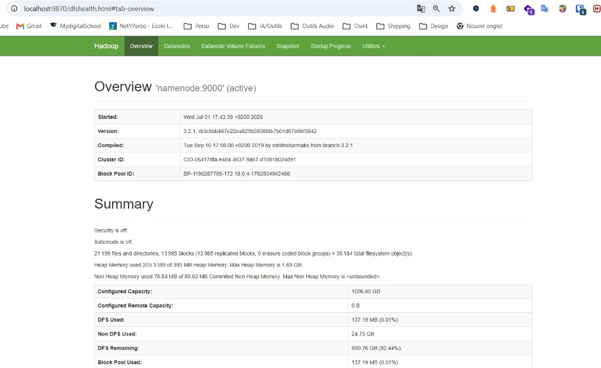
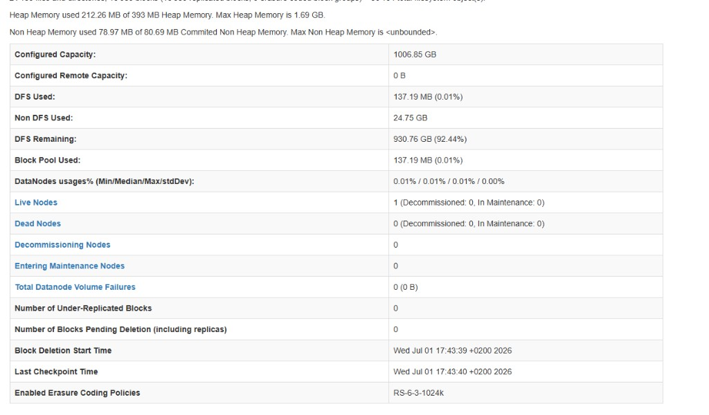
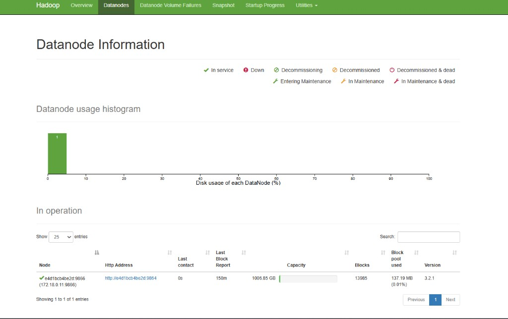
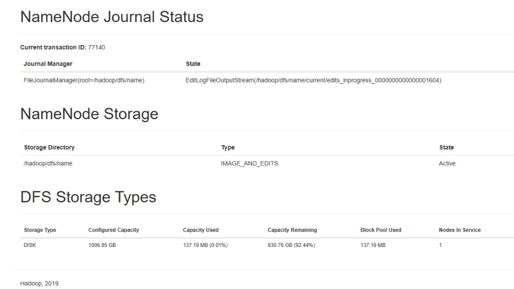

# Projet Big Data — Ingestion Bronze (BCE / KBO)

Pipeline d'ingestion des données des entreprises belges (Banque-Carrefour des
Entreprises). Cette journée couvre la **couche Bronze** : on peuple MongoDB avec
les entreprises, on initialise une **State DB** qui garantit l'idempotence des
téléchargements, puis des **DAGs Airflow** ingèrent les documents NBB/CBSO et
eJustice dans **HDFS**.

## Architecture

```
                +---------------------+
                |   enterprise.csv    |  (Open Data BCE/KBO)
                +----------+----------+
                           |  seed
                           v
   MongoDB  ┌──────────────────────────┐     ┌───────────────────────────┐
            │  companies                │     │  ingestion_state (State DB) │
            │  1 doc / entreprise (BCE) │     │  1 doc / fichier a charger  │
            └────────────┬─────────────┘     │  bce, deposit_id, year,     │
                         │                    │  status(pending/done/error),│
                         │ lit les BCE        │  hdfs_path, timestamps      │
                         v                    └──────────────┬──────────────┘
            ┌──────────────────────────┐                    ^
            │     Airflow DAGs          │  delta detection   │ mise a jour
            │  ingestion_bronze         ├────────────────────┘
            │   - ingest_nbb (CSV+PDF)  │
            │   - ingest_ejustice (PDF) │ ── via Tor (tor1/2/3, rotation IP)
            │   - ingest_stapor (JSON)  │ ── via cookie Playwright (notaire)
            └────────────┬─────────────┘
                         │ ecrit les fichiers bruts
                         v
                 ┌────────────────┐
                 │   HDFS Bronze  │   /data/raw/{source}/{bce}/{type}/...
                 └────────────────┘
```

### Rotation Tor (anti-blocage)

Les sources publiques limitent les requêtes par IP. Le scraping NBB et eJustice
est donc routé à travers trois proxies Tor (`tor1`, `tor2`, `tor3`) en
**round-robin**, avec possibilité de renouveler le circuit (NEWNYM → nouvelle
IP de sortie). Voir `include/http_client.py`. La rotation se vérifie ainsi :

```bash
docker compose exec airflow-scheduler python -c \
  "from include import http_client; print(http_client.public_ip(use_tor=True))"
```

### Source stapor / notaire (cookie anti-bot)

`statuts.notaire.be` est protégé par un challenge JavaScript. Le cookie est
obtenu via **Playwright (Chromium)** puis mis en cache dans HDFS pour être
partagé entre les tâches Airflow (voir `include/notaire_cookie.py`). Un cookie
peut aussi être fourni directement via la variable `COOKIE_NOTAIRE`. Comme le
cookie est lié à l'IP, les appels stapor partent en **direct** (sans Tor).

### Le rôle de la State DB (delta detection)

Dès que les numéros BCE sont dans MongoDB, la collection `ingestion_state` suit
**chaque fichier** : numéro BCE, `deposit_id`, année, statut
(`pending` / `done` / `error`), chemin HDFS et horodatages. Avant chaque
téléchargement, le pipeline vérifie si la clé est déjà `done` : si oui, il
**saute** le fichier. On ne re-télécharge donc jamais ce qui existe déjà.

Clé déterministe d'un fichier : `bce | source | deposit_id | doc_type | year`.

## Structure du dépôt

```
.
├── docker-compose.yml        # Airflow + MongoDB + HDFS (+ mongo-express)
├── Dockerfile                # image Airflow + dependances du pipeline
├── hadoop.env                # configuration HDFS
├── requirements.txt          # dependances pour execution locale
├── .env.example              # variables d'environnement
├── dags/
│   ├── seed_companies_mongo.py    # init : peuple MongoDB + State DB
│   ├── ingestion_bronze.py        # Jour 1 : NBB + eJustice + stapor -> HDFS
│   └── jour2_silver_hotellerie.py # Jour 2 : finale -> silver -> scraping hotels
├── include/
│   ├── config.py                  # configuration centrale
│   ├── mongo_utils.py             # referentiel + State DB (delta detection)
│   ├── hdfs_utils.py              # client WebHDFS + ecriture Bronze
│   ├── http_client.py             # GET avec rotation Tor (round-robin + NEWNYM)
│   ├── notaire_cookie.py          # cookie stapor via Playwright + cache HDFS
│   ├── seed.py                    # chargement des entreprises dans MongoDB
│   ├── sources.py                 # ingestion NBB / eJustice / stapor
│   ├── build_enterprise_finale.py # Jour 2 : fusion des 5 CSV KBO -> Bronze consolide
│   ├── silver.py                  # Jour 2 : transformation Bronze -> Silver
│   └── hotel.py                   # Jour 2 : filtre hotellerie + scraping NBB
└── data/                          # CSV KBO (non versionnes)
```

## Sources de données

| Source       | Contenu                              | Format         | Accès        |
|--------------|--------------------------------------|----------------|--------------|
| KBO Open Data| référentiel des entreprises belges   | CSV → MongoDB  | local        |
| NBB / CBSO   | comptes annuels (consult.cbso.nbb.be)| CSV + PDF      | via Tor      |
| eJustice     | publications du Moniteur belge       | PDF            | via Tor      |
| stapor       | statuts notariés (statuts.notaire.be)| JSON (+ PDF)   | cookie direct|

## Démarrage rapide

### 1. Lancer l'infrastructure

```bash
docker compose build
docker compose up -d
```

Services exposés :

| Service        | URL                     | Identifiants     |
|----------------|-------------------------|------------------|
| Airflow        | http://localhost:8080   | airflow / airflow|
| HDFS NameNode  | http://localhost:9870   | —                |
| Mongo Express  | http://localhost:8081   | —                |
| Tor (SOCKS5)   | localhost:9050/9052/9054| —                |

### 2. Exécuter les DAGs

1. Déclencher **`seed_companies_mongo`** → peuple MongoDB et crée les index de
   la State DB.
2. Déclencher **`ingestion_bronze`** → télécharge CSV + PDF vers HDFS Bronze
   en appliquant la delta detection.

Limiter le nombre d'entreprises par run via la variable `INGEST_LIMIT`
(défaut : 10).

### 3. Vérifier le résultat

```bash
# Fichiers Bronze dans HDFS
docker exec -it namenode hdfs dfs -ls -R /data/raw | head

# Etat de la State DB
docker exec -it mongo mongosh bce --eval \
  'db.ingestion_state.aggregate([{$group:{_id:"$status",n:{$sum:1}}}])'
```

## Idempotence (preuve de la delta detection)

Relancer `ingestion_bronze` une seconde fois : tous les fichiers déjà chargés
passent en `skipped` (aucun nouveau téléchargement), ce qui démontre que la
State DB empêche les re-téléchargements.

## Jour 2 — Couche Silver & ciblage hôtellerie

Le Jour 2 consolide les données brutes puis cible le **secteur hôtelier** pour
en scraper les comptes annuels NBB (exercices ≥ 2021).

```
enterprise_finale  ──►  enterprise_silver  ──►  filtre hôtellerie  ──►  hotel_state
   (Bronze fusion)         (nettoyé/enrichi)      (NACE 55xxx…)          (State DB)
   5 CSV KBO                                                                  │
                                                                             ▼
                                                             scraping NBB CSV (≥2021)
                                                                  → HDFS Bronze
```

**Collections MongoDB créées :**

| Collection          | Rôle                                                        |
|---------------------|------------------------------------------------------------|
| `enterprise_finale` | Bronze consolidé : 1 doc riche/entreprise (fusion 5 CSV)    |
| `enterprise_silver` | Silver : dates normalisées, activités dédupliquées, labels  |
| `hotel_state`       | State DB hôtellerie (1 doc/hôtel : status, filings_count)   |

**Étapes de transformation Silver** (`include/silver.py`) :
1. `StartDate` `DD-MM-YYYY` → `YYYY-MM-DD` ;
2. déduplication des activités (même NaceCode + Classification) ;
3. adresse unique : on ne garde que le siège `REGO` ;
4. dénomination officielle (`TypeOfDenomination = 1`) placée en premier ;
5. décodage des codes → libellés FR (`code.csv`).

**Ciblage hôtellerie** (`include/hotel.py`) : `Status = AC`, `TypeOfEnterprise = 2`,
activité **MAIN** avec un code NACE hôtelier (`55100`, `55201…55900`), formes
juridiques publiques exclues.

**Données** : si les 5 CSV KBO (`enterprise`, `denomination`, `address`,
`activity`, `code`) sont présents dans `data/`, ils sont fusionnés (borne
`SEED_LIMIT`). Sinon, un **jeu de démonstration** est chargé : 4 vrais hôtels
belges (avec comptes annuels NBB) + entreprises non hôtelières, ce qui rend
toute la chaîne démontrable sans le gros téléchargement.

**Exécuter le Jour 2 :** déclencher le DAG **`jour2_silver_hotellerie`**.
Bornes optionnelles : `SEED_LIMIT` (chargement `enterprise_finale`) et
`HOTEL_LIMIT` (nombre d'hôtels scrapés). Le 429 (rate limit NBB) fait passer
l'hôtel en `error` : il est repris au run suivant via la State DB.

## Résultats (preuves d'exécution)

Exécution complète sur le jeu de données KBO réel.

**MongoDB (base `bce`) :**

| Collection          | Documents   | Détail                                   |
|---------------------|-------------|------------------------------------------|
| `companies`         | 1 954 629   | référentiel BCE (seed complet)           |
| `enterprise_finale` | 1 954 629   | Bronze consolidé (fusion des 5 CSV KBO)  |
| `enterprise_silver` | 1 954 629   | Silver (dates, dédup, REGO, labels)      |
| `hotel_state`       | 4 918       | hôtels ciblés — **4 486 `done`**         |
| `ingestion_state`   | 14 416      | State DB fichiers (delta detection)      |

**HDFS Bronze :** ~14 000 fichiers CSV de comptes annuels NBB écrits dans
`/data/raw/nbb/{bce}/csv/{year}.csv` (13 985 blocs, DataNode `In service`).

Interface web du NameNode (http://localhost:9870) :









## Workflow Git

- Le travail de chaque journée est livré sur une branche dédiée.
- Jour 1 : branche **`INGESTION-BRONZE`**.
- Jour 2 : branche **`JOUR2`**.
- La branche **`main`** ne contient que la dernière version fonctionnelle.
